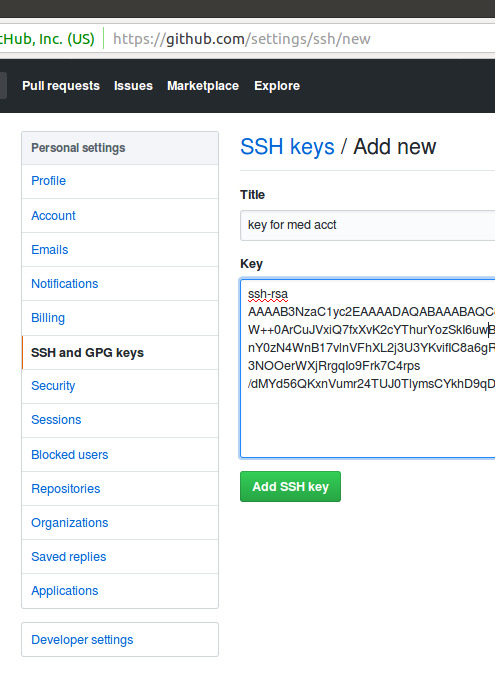

# README.md

# Invitation

I invite you to join me in the development of this repo.

I am easy to reach: bikle101@gmail.com

# Setup Your Dev Env

I ask that you do your development on Ubuntu 16.04 which I use.

If we both use the same OS, development is smoother.

I have a Virtualbox Ubuntu appliance you can use:

https://drive.google.com/file/d/10p1W7kqzxE69jODhUzcb-qi-osN4htO-

After you import the above appliance into your laptop,
you can login to the ann account using password: 'a'.

After that, I suggest you change the password.

Next, create an account named 'med':

```
sudo useradd -m -s /bin/bash -G sudo med
sudo passwd med
```

Generate keys:

```
ssh -AY med@localhost
ssh-keygen -t rsa
```

Install software:

```
sudo apt update

sudo apt upgrade

sudo apt install build-essential libssl-dev             \
libreadline6-dev zlib1g-dev libncurses5-dev libffi-dev  \
libgdbm3 libgdbm-dev sqlite3 libsqlite3-dev libyaml-dev \
emacs postgresql postgresql-server-dev-all nodejs       \
libpq-dev wget curl gitk ruby ruby-dev autoconf bison
```

If Ubuntu complains about apt update, just give it 30 minutes to "catch-up".

After you install the software listed above, you should install more software:

```
cd ~med
git clone https://github.com/rbenv/rbenv      .rbenv
git clone https://github.com/rbenv/ruby-build .rbenv/plugins/ruby-build
curl -L rails4.us/.gemrc > ~/.gemrc
```

If that goes well you add syntax to ~med/.bashrc file:

```
if [ -e ${HOME}/.rbenv ]; then
  export PATH="$HOME/.rbenv/bin:$PATH"
  eval "$(rbenv init -)"
fi
```

Then, you should install more software:

```
bash
rbenv install 2.6.0
rbenv global  2.6.0
gem install rails -v 5.2.2
```

Next, you should create an account on github.com.

Or, login to your github account.

Then, in the settings, use your mouse to paste ~med/.ssh/id_rsa.pub into the ssh-textarea.



Then, you should vist this URL with your browser:

https://github.com/danbikle/med

In the upper right, click the fork link which will fork the med-repo for you.

Github should respond by showing you the repo of the fork.

Then, you should clone the fork with syntax like this:

```
cd ~med
git clone git@github.com:uraccount/med
```

The above syntax is example.

Your account will have a different name than "uraccount".

Next, you should ensure that the med-repo has all the gems it needs:

```
cd ~med/med
bundle
```

Then, you should start the local webserver:

```
cd ~med/med
script/railss.bash
```

Next, visit this URL to create a heroku account:

https://signup.heroku.com/

Then, install Heroku software:

```
cd ~med/
wget https://cli-assets.heroku.com/heroku-cli/channels/stable/heroku-cli-linux-x64.tar.gz
tar xf heroku-cli-linux-x64.tar.gz
mv heroku*linux-x64 heroku
echo 'export PATH=${HOME}/heroku/bin:$PATH' >> ~med/.bashrc
bash
```

Next, login via bash-command:

```
heroku auth:login
heroku status
```

Then, create an app on heroku:

```
heroku create mymed1
```

If someone else has already claimed the name: "mymed1", try a different name like: "urmed72".

Next, push your copy of the repo to herok:

```
git push heroku master
```

To see a short development iteration, commit a small change to the repo:

```
cd ~med/med
echo Dan was here > ~med/med/public/dan.html
git add .
git commit -am more-isbetter
git push origin master
git push heroku master
```

Then, visit your repo on github.

From there, use the web-UI to submit a pull request to danbikle/med

Wait for Dan to merge the pull request

Next, git-pull danbikle/med into both copies of your fork repo.

Remember, that you have two copies of the fork repo:

* One copy on github
* One copy on your laptop in the ~med/med/ folder

Then, git-push the fork into Heroku:

```
git push heroku master
```

